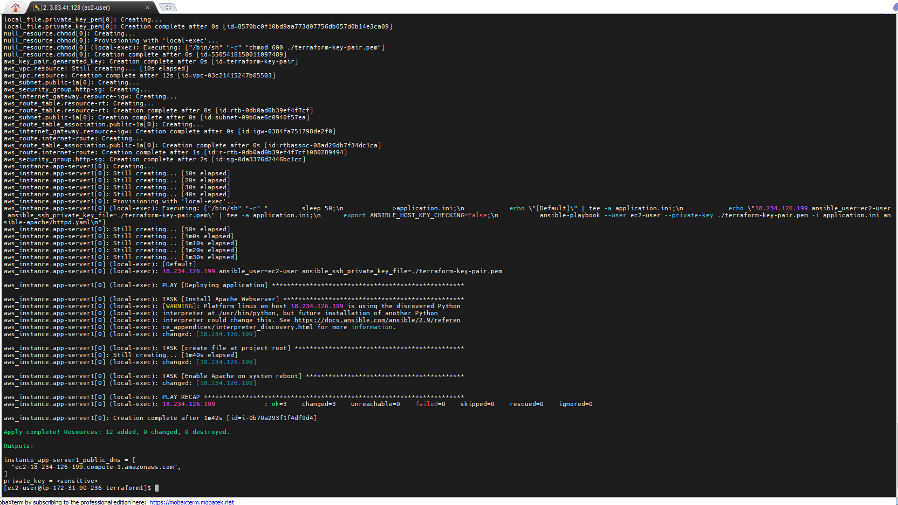
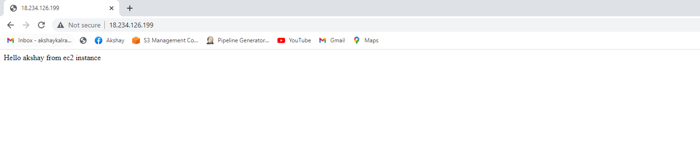

Self note for future 

Compute.tf has dos2unix problem. Run utility before running ansible in linux box.

+ ansible-apache to run application using ansible

terraform.auto.tfvars
//AWS
region = "us-east-1"
vpc_cidr             = "10.20.20.0/26"
public_subnets_cidr  = ["10.20.20.0/28"]
access_key="AKIAZXXXX"
secret_key="SgDZMXXXXXXX/0"